# A hight quality tools to reverse engineering code from android.
This project aims to select the best tools, to get the code from apk to .java.
A second objective is set the state of art for reverse engineering tools (Apr, 2017).

Lets Go! This project is maintained by @nextco

> No process guarantees 100% code reversion
> but surely we can achieve clues to ensure the highest accuracy.

## The process 
Install, intense test the tools, no short path and select the best.  
Tested on Arch Linux & Windows 8.1 Pro  
Time Spend: 5 days  

## Background
A curated list is create by [Aditya Agrawal](https://github.com/exploitprotocol/mobile-security-wiki)
[The preview](https://mobilesecuritywiki.com/#-reverse-engineering-tools-)

## Get info of Apk
### Goal -  Get AndroidManifest.xml
Get permissions, activity names, package names
- Primary tool: ClassyShark 8.0 [Download](https://github.com/google/android-classyshark/releases) by google
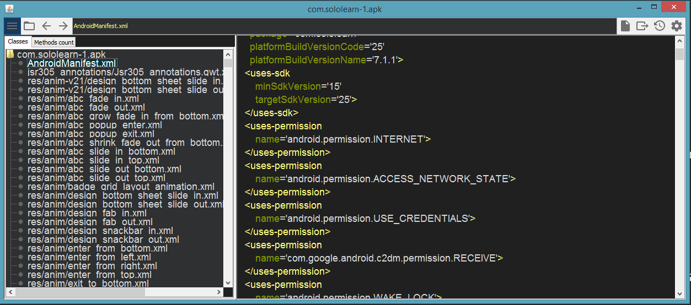  

ClassyShark is also useful to accurate spy the class, constructors, variables and method names

  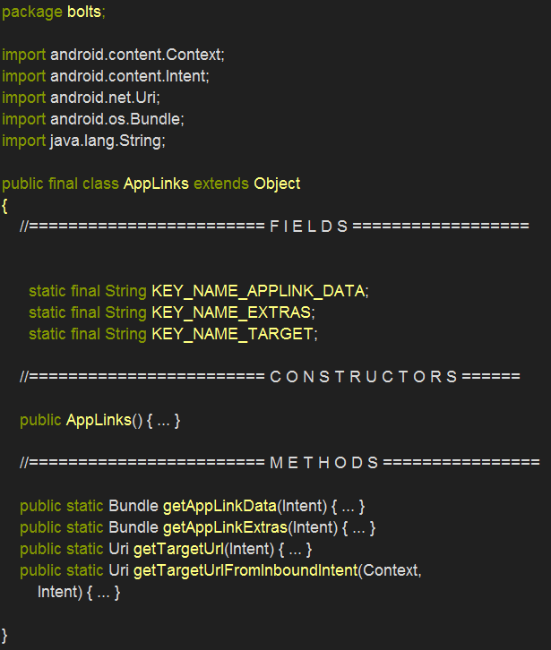

### Goal -  Get Resources
Like a images, assets, html, sounds, js

- Primary tool: Apktool 2.2.2 [Download](https://ibotpeaches.github.io/Apktool/) by ibotpeaches

  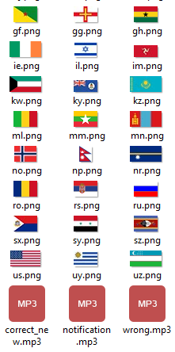

## Get .jar from .apk
.dex files need translated to java bytecode, this process are critical because of this output depend the accuracy on obtained code

- Primary tool: enjarify 1.0.3 [Download](https://github.com/Storyyeller/enjarify) by Storyyeller
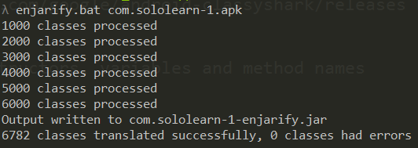  

I know dex2jar, on this project aim to select the best tools currently, dex2jar is careless and outdated.

## Get .java from .jar
Fortunately on this point are good choices, they are sorted by use.
- Show Java Android App [Download](https://play.google.com/store/apps/details?id=com.njlabs.showjava)
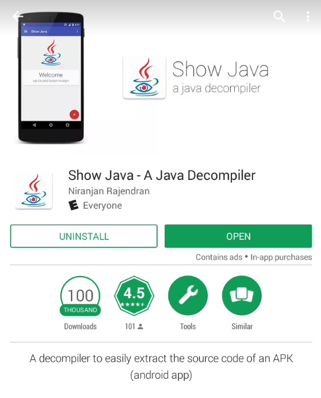
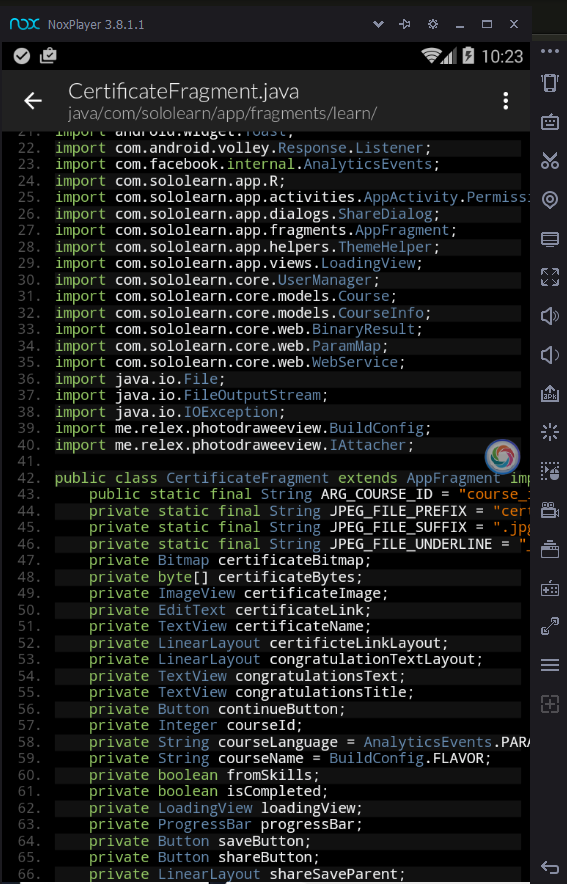

- jadx-gui [Download](https://github.com/skylot/jadx)
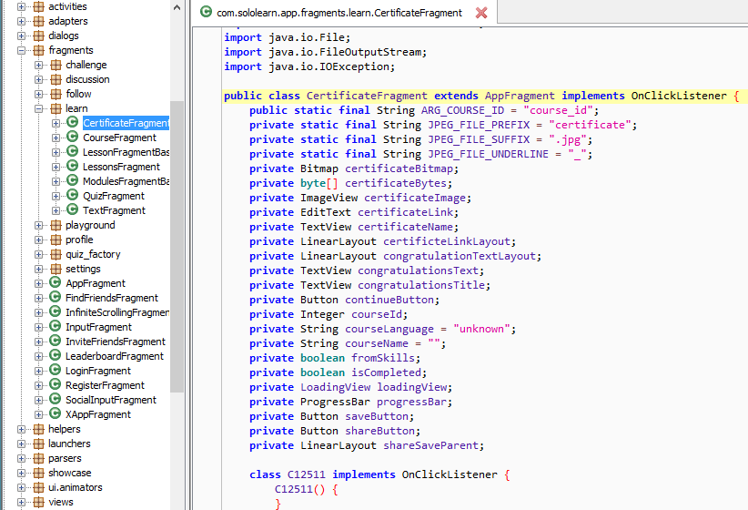
  

- jd-gui

  

  

- CFR 0_121 [Download](http://www.benf.org/other/cfr/)

  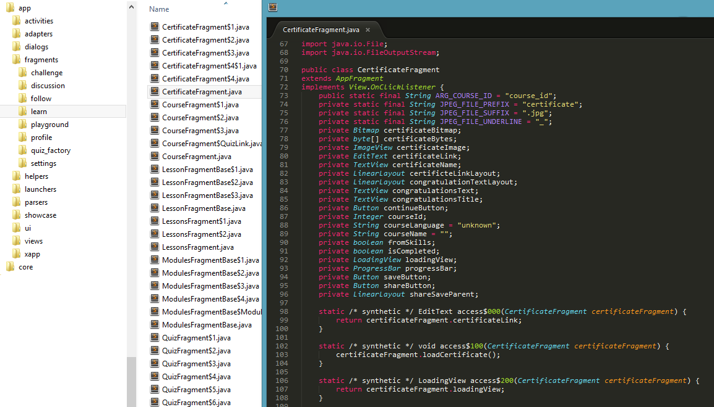

  

- d4j-procyon [Download](https://secureteam.net/d4j)
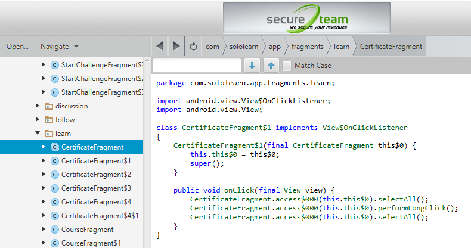

Also tested, FernFlower & Krakatau unsuccessfully

## Extra - Android Player
This is special category, because i want Play Store, Games, Apps a virtual replace of my android on PC, not for dev. A complete replace for phone on pc for daily use.

- Primary tool: Nox Player 3.8.1.1 [Download](https://www.bignox.com/)

  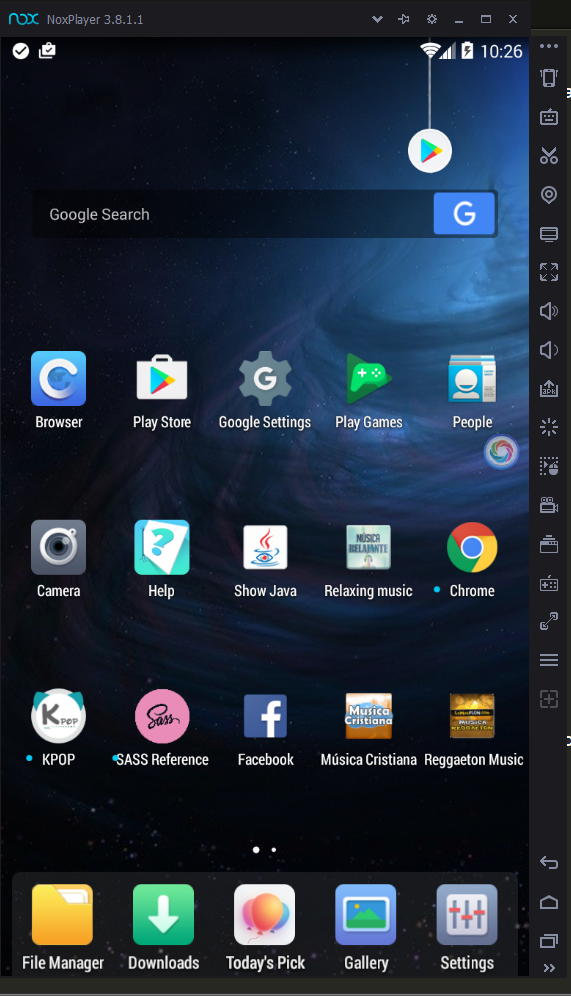

Also test BlueStacks to lag for me.

## Next Steps.
On next steps for dev app best emulator are of course, Android Emulator

  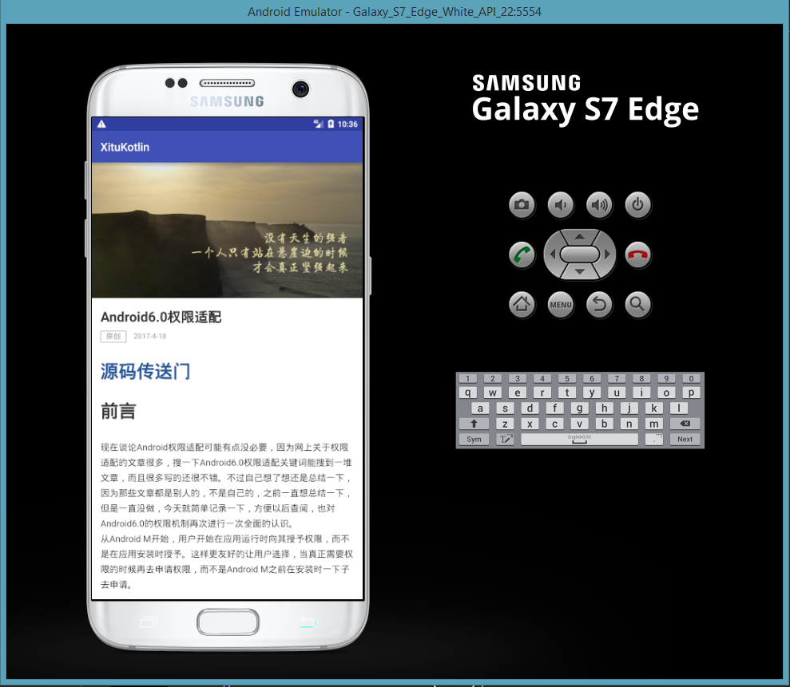

